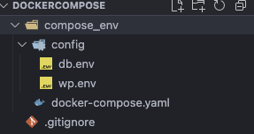

# App WordPress com Docker

Aplicação de estudo/trabalho baseada em WordPress e banco MySQL, orquestrada com Docker Compose.



## O que está incluso

- Serviço `wordpress` usando a imagem `wordpress:latest` (porta 8000 no host mapeada para 80 no container).
- Serviço `db` usando a imagem `mysql:8.0` (volume persistente `db_data` para /var/lib/mysql).

> Observação: a `version` do Compose foi removida do `docker-compose.yaml` porque é obsoleta quando se usa a CLI moderna (`docker compose`).

## Alterações feitas neste repositório

- Removida a chave `version` do `docker-compose.yaml` para evitar warnings.
- Substituída a imagem `mysql:5.7` por `mysql:8.0` para garantir suporte multi-arch (Apple Silicon / arm64). Se você precisar manter `mysql:5.7`, veja a seção "Alternativas" abaixo.
- Diagnóstico de erro ENOENT para um arquivo de imagem referenciado (`image/README/1761778666358.png`). O README sugere criar um placeholder se você encontrar esse erro localmente.

## Como rodar (macOS / Docker Desktop)

1. Abra o Docker Desktop e aguarde o daemon subir. Verifique com:

```bash
docker info
docker --version
```

2. No diretório deste projeto (/Users/douglassouza/Downloads/dockerCompose), suba os serviços:

```bash
# usando a CLI moderna (recomendada)
docker compose up -d --build

# ou usando docker-compose (legacy)
docker-compose up -d --build
```

3. Acesse o WordPress em: http://localhost:8000
4. Para parar e remover containers/volumes:

```bash
docker compose down -v
```

## Problemas comuns e soluções

- Erro "Cannot connect to the Docker daemon": abra o Docker Desktop (ou inicie o daemon) antes de rodar o compose.
- Erro de manifest para ARM (ex.: "no matching manifest for linux/arm64/v8"): troquei para `mysql:8.0` que já tem suporte arm64. Alternativa: adicionar `platform: linux/amd64` ao serviço `db` para forçar emulação (mais lento).
- ENOENT para `/Users/.../image/README/1761778666358.png`: crie um arquivo placeholder ou remova a referência. Exemplo para criar um placeholder PNG 1x1 transparente:

```bash
mkdir -p image/README
printf 'iVBORw0KGgoAAAANSUhEUgAAAAEAAAABCAQAAAC1HAwCAAAAC0lEQVR4nGNgYAAAAAMAAWgmWQ0AAAAASUVORK5CYII=' | base64 -d > image/README/1761778666358.png
```

Se `base64 -d` não funcionar no seu sistema, troque por `base64 -D`.

## Alternativas

- Se preferir não usar `mysql:8.0`, você pode usar `mariadb:10.x`, que costuma ter bom suporte para arm64 e é compatível com WordPress.
- Para manter `mysql:5.7` e rodar no Apple Silicon, adicione no `docker-compose.yaml`:

```yaml
services:
	db:
		image: mysql:5.7
		platform: linux/amd64
		...
```

## Observações finais

- Use `clear` no terminal macOS / zsh (o comando `cls` não existe por padrão).

---
